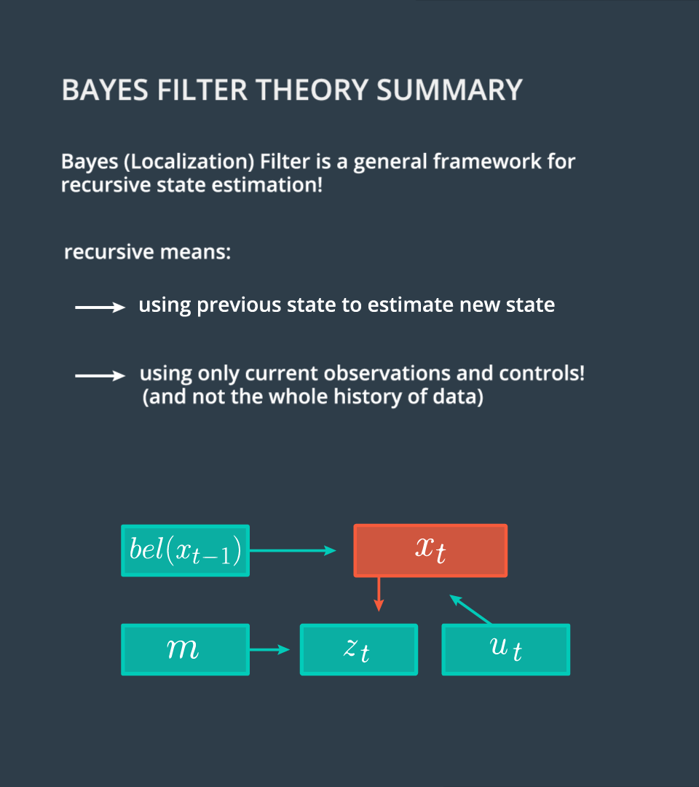

# Markov Localization

## Theory

Markov Localization or Bayes Filter for Localization is a generalized filter for localization and all other localization approaches are realizations of this approach, as we'll discuss later on.
By learning how to derive and implement (coding exercises) this filter we develop intuition and methods that will help us solve any vehicle localization task, including implementation of a particle filter. We don't know exactly where our vehicle is at any given time, but can approximate it's location. As such, we generally think of our vehicle location as a probability distribution, each time we move, our distribution becomes more diffuse (wider). We pass our variables (map data, observation data, and control data) into the filter to concentrate (narrow) this distribution, at each time step.Each state prior to applying the filter represents our prior and the narrowed distribution represents our Bayes' posterior.

### Apply Bayes Rule with additional conditions

We aim to estimate state beliefs bel(xt)bel(x_t)bel(xt​) without the need to carry our entire observation history. We will accomplish this by manipulating our posterior p(xt∣z1:t−1,μ1:t,m)p(x_t|z_{1:t-1},\mu_{1:t},m)p(xt​∣z1:t−1​,μ1:t​,m), obtaining a recursive state estimator. For this to work, we must demonstrate that our current belief bel(xt)bel(x_t)bel(xt​) can be expressed by the belief one step earlier bel(xt−1)bel(x_{t-1})bel(xt−1​), then use new data to update only the current belief. This recursive filter is known as the Bayes Localization filter or Markov Localization, and enables us to avoid carrying historical observation and motion data. We will achieve this recursive state estimator using Bayes Rule, the Law of Total Probability, and the Markov Assumption.

We take the first step towards our recursive structure by splitting our observation vector z1:t z_{1:t} z1:t​ into current observations ztz_tzt​ and previous information z1:t−1z_{1:t-1}z1:t−1​. The posterior can then be rewritten as p(xt∣zt,z1:t−1,u1:t,m)p(x_t|z_t,z_{1:t-1},u_{1:t}, m) p(xt​∣zt​,z1:t−1​,u1:t​,m).

Now, we apply Bayes' rule, with an additional challenge, the presence of multiple distributions on the right side (likelihood, prior, normalizing constant). How can we best handle multiple conditions within Bayes Rule? As a hint, we can use substitution, where xt x_t xt​ is a, and the observation vector at time t, is b. Don’t forget to include u u u and m m m as well. We get the following equation -

**1. Since we (hypothetically) know in which state the system is at time step t-1, the past observations z1:t−1z_{1:t-1}z1:t−1​ and controls u1:t−1u_{1:t-1}u1:t−1​ would not provide us additional information to estimate the posterior for xtx_txt​, because they were already used to estimate xt−1x_{t-1}xt−1​. This means, we can simplify p(xt∣xt−1,z1:t−1,u1:t,m)p(x_t|x_{t-1}, z_{1:t-1}, u_{1:t},m)p(xt​∣xt−1​,z1:t−1​,u1:t​,m) to p(xt∣xt−1,ut,m)p(x_t|x_{t-1}, u_t, m)p(xt​∣xt−1​,ut​,m).**

**2. Since utu_tut​ is “in the future” with reference to xt−1,utx_{t-1}, u_txt−1​,ut​ does not tell us much about xt−1x_{t-1}xt−1​. This means the term p(xt−1∣z1:t−1,u1:t,m)p(x_{t-1}|z_{1:t-1}, u_{1:t}, m)p(xt−1​∣z1:t−1​,u1:t​,m) can be simplified to p(xt−1∣z1:t−1,u1:t−1,m)p(x_{t-1}|z_{1:t-1}, u_{1:t-1}, m)p(xt−1​∣z1:t−1​,u1:t−1​,m)**

The image above sums up the core achievements of this lesson.

The Bayes Localization Filter Markov Localization is a general framework for recursive state estimation.
That means this framework allows us to use the previous state (state at t-1) to estimate a new state (state at t) using only current observations and controls (observations and control at t), rather than the entire data history (data from 0:t).

The motion model describes the prediction step of the filter while the observation model is the update step.
The state estimation using the Bayes filter is dependent upon the interaction between prediction (motion model) and update (observation model steps) and all the localization methods discussed so far are realizations of the Bayes filter.
In the next few sections we will learn how to estimate pseudo ranges, calculate the observation model probability, and complete the implementation of the observation model in C++.

